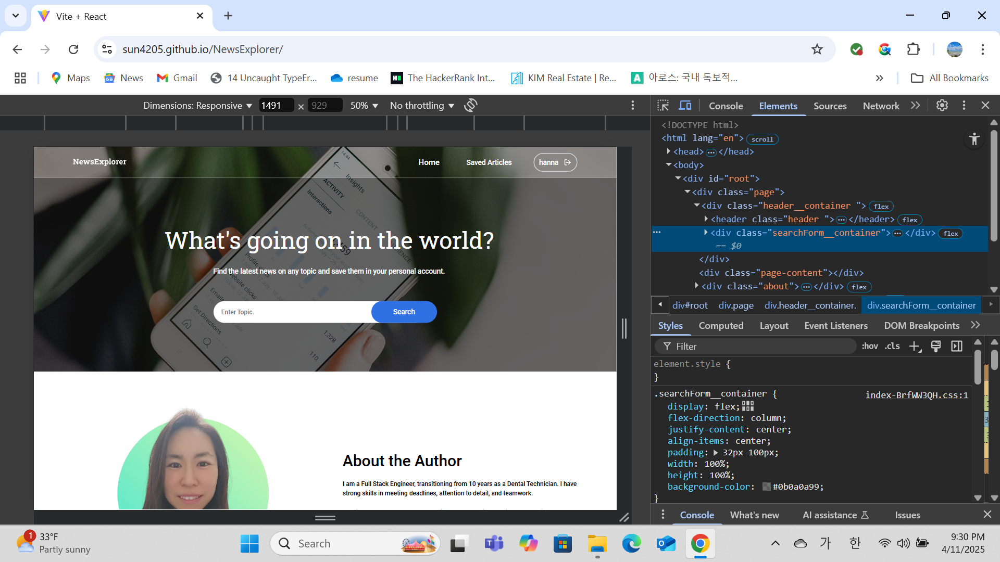
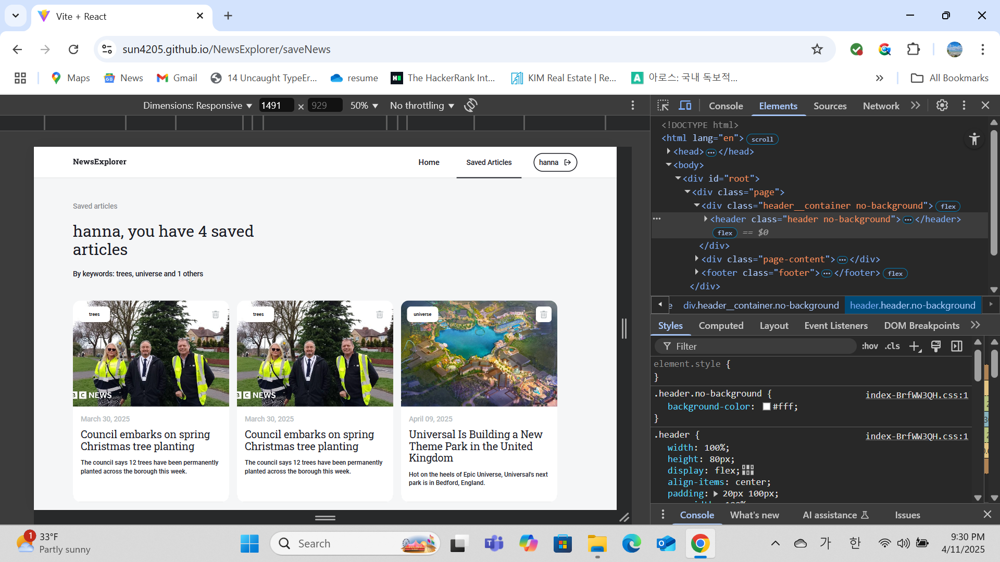

# Final project : News Explorer

## A description of the project and its functionality

News Explorer is a web application that allows users to search for news articles. Users can enter a keyword to find relevant articles, which are displayed in a clean, responsive grid. Logged-in users can save or delete articles.

## Technologies and techniques used

- CSS: CSS (Cascading Style Sheets) allows to create great-looking web pages.
- Javascript: A programming language that helps make web pages interactive.
- Vite : modern build tool designed to improve the development experience for web applications.
- API: The News API is used to fetch articles based on search keywords, allowing users to explore relevant news content.
- React: React is a JavaScript library that uses reusable UI components, making it convenient to build web applications.
- JSX : Allows writing HTML-like syntax inside JavaScript, making it easier to create React components.
- Node.js & Express – Backend technologies used to handle API requests and serve data securely.
- Render – A cloud platform used to deploy both the frontend and backend applications.

## Screenshot
This is the main page where users can search for news articles.

This shows the search results after entering a keyword.

## Deploy
- Frontend: [https://sun4205.github.io/NewsExplorer](https://sun4205.github.io/NewsExplorer)
- Backend: [https://newsexplorer-express.onrender.com](https://newsexplorer-express.onrender.com)